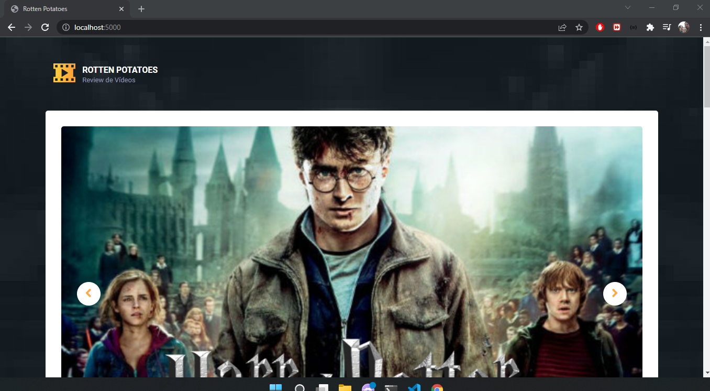

# Aplicação rotten-potatoes

## Configuração DB

MONGODB_DB => Nome do database

MONGODB_HOST => Host do MongoDB

MONGODB_PORT => Posta de acesso ao MongoDB

MONGODB_USERNAME => Usuário do MongoDB

MONGODB_PASSWORD => Senha do MongoDB

